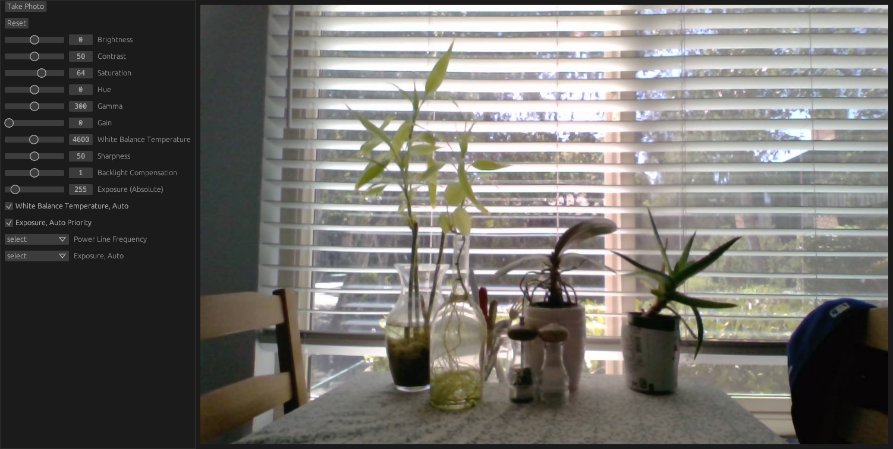

# KissCam: A simple webcam app for linux :kissing_heart:
---
## Features
In addition to taking photos, KCam allows you to control all of the image options supported by your hardware. These settings are persistent, so you can tune your webcam exactly to your liking before using other video apps (Google Meet, Microsoft Teams, etc). Built with [egui](https://github.com/emilk/egui).

